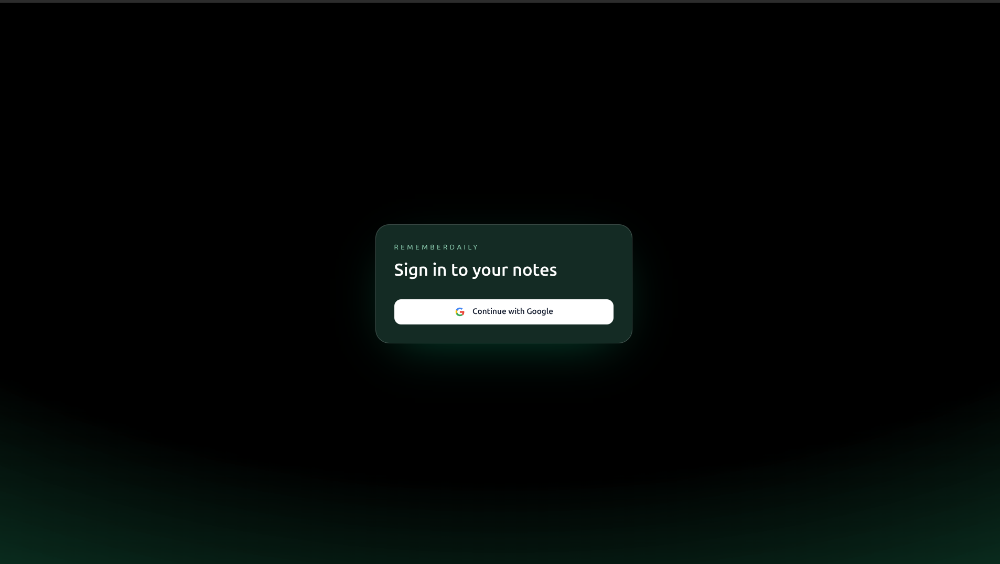
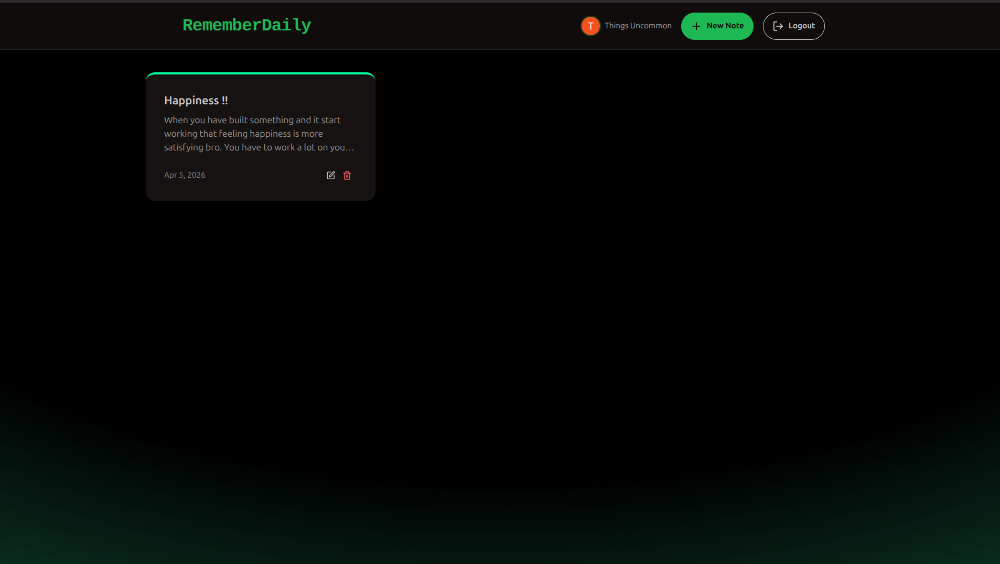
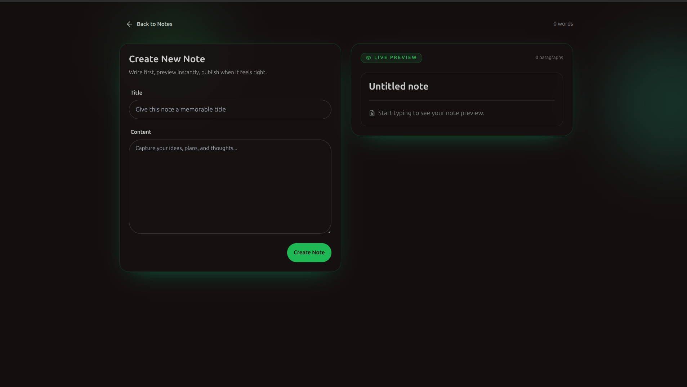

<h1 align="center">Note Taking App</h1>

Highlights of this project :

- Full stack App Built with the MERN Stack (MongoDB, Express, React, Node, Upstash(Redis)).
- Create, Update, and Delete Notes with Title & Description, with live preview.
- Built and Tested a fully functional REST API.
- Rate Limiting with Upstash Redis.
- Google signin Authentication.

---
## Preview







---
## Run the Backend

```
cd backend
npm install
npm run dev
```

## Run the Frontend

```
cd frontend
npm install
npm run dev
```

---
## Note 
- This project was built by me to understand the both frontend and backend working. Always i used to see the meme that people when they learn web development they usually build one project `Todo application`. So yeah, I thought let the legacy must be continued. It was fun to build this project.

---
